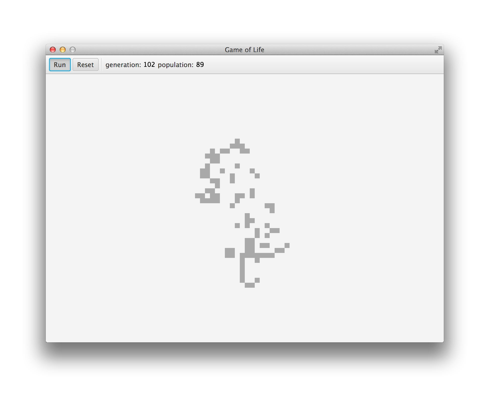

# Note
- This repo was cloned by Kyle Romero from https://github.com/stevebakh/game-of-life
- No new code has been written, this is simply to understand Scala and SBT
- Used Chocolatey to install SBT via 'choco install sbt'
- sbt run will build and run the game
  
# Game of Life
A simple Scala implementation of Conway's Game of Life with a ScalaFX (JavaFX) UI.

As of April 2020, updated to use the most recent ScalaFX release and Java 13.

A JEnv `.java-versions` file is included in the root of the project to locally set this project to use Java 13 (for those with both JEnv _and_ Java 13 installed). 

Current usage:
`sbt run` or `sbt test`
